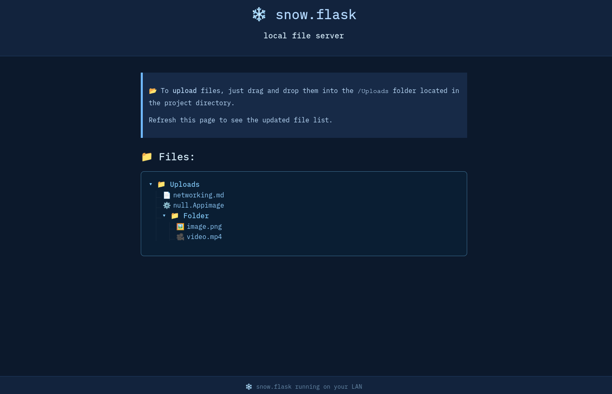

# ❄️ snow.flask

A simple, retro-themed local file server built with Flask.

Easily serve and download files from a shared `Uploads/` directory on your local Wi-Fi network. No external tools required — just run the Python script and access the web UI from any device on the same network.



---

## Features

- Access the server from any device on the same Wi-Fi
- Download files via a clean, retro-styled web interface
- No setup needed beyond Python and Flask
- Minimal UI with drag-and-drop instructions
- Sanitised File Traversal

---

## 📦 Requirements

- Python 3.7+
- Flask

To install dependencies:

```bash
python -m venv venv
source venv/bin/activate
pip install -r req.txt
```

Or manually:

```bash
python -m venv venv
source venv/bin/activate
pip install Flask
```

---

## ▶ How to Run

1. Place the files you want to share into the `Uploads/` folder.
2. Activate the venv:

```bash
    source venv/bin/activate
```
2. Start the server:

```bash
    python snowflask.py
```

3. After starting, you’ll see something like:

```
Access the server on this device: http://localhost:5000
Access from other devices:     http://192.168.X.X:5000
```

4. Open the appropriate URL in any browser.

---

## Uploading Files

This app does **not** have a web-based uploader (by design, as it is meant to be a quick and dirty way to share files).

To upload:

* Simply **drag and drop** files into the `/Uploads` folder using your file explorer or terminal.
* Refresh the web page to see them appear.

---

## Notes

* This is intended for **local network use only** — it is not secure for public internet use.
* Make sure port `6002` is open on your firewall if accessing from other devices.
* To change the port, edit `snowflask.py`.

---

## 📄 License

MIT License — free to use, modify, and share.

---
